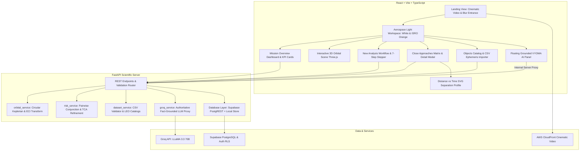

# VYOMA — Space Debris Collision Risk Estimator

**Organization Context:** Department of Space — ISRO (Indian Space Research Organisation)  
**Classification:** Space Situational Awareness (SSA) Approximate Screening Platform

---

## 1. Executive Overview

**VYOMA** (व्योम — Sanskrit for *Sky / Celestial Expanse*) is a high-precision, scientific visualization and approximate orbital collision risk screening web platform engineered for satellite flight dynamics officers and mission operators.

The platform provides rapid preliminary conjunction triage for primary satellite assets against Low Earth Orbit (LEO) space debris fields (breakup clouds, spent upper stages, derelict payloads, and fragment shards). It integrates:

- **Cinematic Landing Experience**: Atmospheric opening with full-screen video and entrance transitions.
- **Aerospace Light Design System**: Clean white workspace accented with official ISRO Orange (`#EA580C`), high-contrast tabular readouts, and zero visual clutter.
- **Interactive 3D Orbital Scene**: GPU-accelerated Three.js celestial canvas displaying the Earth, dynamic Keplerian orbit tracks, satellite markers, debris fields, and conjunction proximity indicators.
- **Numerical Astrodynamics Engine**: FastAPI + NumPy implementation of circular Keplerian mechanics with pairwise Euclidean distance search and sub-second parabolic minimum refinement.
- **Estimated Risk Screening Matrix**: Threshold-based risk tiering (`CRITICAL`, `HIGH`, `MODERATE`, `LOW`).
- **Server-Side VYOMA AI Assistant**: Context-grounded orbital intelligence proxy powered by Groq LLMs with strict demarcation between **COMPUTED FACTS** and **AI OPERATIONAL INTERPRETATIONS**.
- **Hybrid Data Persistence**: Full Supabase PostgreSQL schema with Row-Level Security (RLS), paired with a seamless zero-dependency local repository fallback.

---

## 2. System Architecture



---

## 3. Astrodynamical Model & Formulations

### 3.1 Two-Body Circular Keplerian Mechanics (`orbital_service.py`)
- **Earth Geodetic Parameters (Spherical WGS-84 Approximation):**
  $$R_{\text{Earth}} = 6378.137\text{ km}, \quad \mu_{\text{Earth}} = 398600.4418\text{ km}^3/\text{s}^2$$
- **Geocentric Semi-Major Axis ($r$):**
  $$r = R_{\text{Earth}} + h_{\text{altitude}}$$
- **Mean Motion ($n$) and Orbital Period ($T$):**
  $$n = \sqrt{\frac{\mu}{r^3}} \quad [\text{rad/s}], \qquad T = \frac{2\pi}{n} \quad [\text{seconds}]$$
- **Circular Orbital Speed ($v$):**
  $$v = \sqrt{\frac{\mu}{r}} \quad [\text{km/s}]$$
- **Time Evolution in Orbital Plane:**
  $$\theta(t) = \theta_0 + n \cdot t$$
- **Transformation to Earth-Centered Inertial (ECI) Frame:**
  Using orbital inclination $i$ and Right Ascension of Ascending Node (RAAN) $\Omega$:
  $$\begin{aligned}
  X(t) &= r \left(\cos\Omega \cos\theta(t) - \sin\Omega \sin\theta(t) \cos i\right) \\
  Y(t) &= r \left(\sin\Omega \cos\theta(t) + \cos\Omega \sin\theta(t) \cos i\right) \\
  Z(t) &= r \left(\sin\theta(t) \sin i\right)
  \end{aligned}$$
  and corresponding velocity components:
  $$\begin{aligned}
  V_X(t) &= v \left(-\cos\Omega \sin\theta(t) - \sin\Omega \cos\theta(t) \cos i\right) \\
  V_Y(t) &= v \left(-\sin\Omega \sin\theta(t) + \cos\Omega \cos\theta(t) \cos i\right) \\
  V_Z(t) &= v \left(\cos\theta(t) \sin i\right)
  \end{aligned}$$

### 3.2 Conjunction Screening & TCA Minimization (`risk_service.py`)
- **Relative Position & Separation Distance:**
  $$\mathbf{\Delta r}(t) = \mathbf{r}_{\text{sat}}(t) - \mathbf{r}_{\text{deb}}(t), \qquad d(t) = \|\mathbf{\Delta r}(t)\|$$
- **Local Parabolic TCA Refinement:**
  A discrete search over the propagation window (e.g. 24h at 60s steps) pinpoints candidate minima, followed by localized fine sampling ($\pm 120\text{s}$ at sub-second increments) to isolate the true geometric Time of Closest Approach ($t_{\text{TCA}}$).
- **Relative Hypervelocity Vector at TCA:**
  $$\mathbf{v}_{\text{rel}} = \mathbf{v}_{\text{sat}}(t_{\text{TCA}}) - \mathbf{v}_{\text{deb}}(t_{\text{TCA}}), \qquad v_{\text{rel}} = \|\mathbf{v}_{\text{rel}}\|$$

### 3.3 Estimated Risk Categorization
| Category | Miss Distance ($d_{\min}$) | Operational Conjunction Implication |
| :--- | :--- | :--- |
| **CRITICAL** | $d < 5.0\text{ km}$ | Immediate secondary sensor tasking; conjunction assessment alert |
| **HIGH** | $5.0\text{ km} \le d < 15.0\text{ km}$ | Heightened monitoring; tracking covariance refinement required |
| **MODERATE** | $15.0\text{ km} \le d < 50.0\text{ km}$ | Routine proximity watch; catalog propagation check |
| **LOW** | $d \ge 50.0\text{ km}$ | Clear passage; nominal orbital separation |

---

## 4. Technical Limitations & Disclaimer

> [!IMPORTANT]
> **APPROXIMATE SCREENING DISCLAIMER:**  
> This platform implements an unperturbed circular Keplerian propagation engine designed exclusively for educational demonstration and preliminary geometric triage. It does **not** replace operational Conjunction Assessment Risk Analysis (CARA) flight safety systems.

### Unmodeled Astrodynamic Perturbations:
1. **Atmospheric Neutral Drag:** Orbital decay and secular in-track deceleration below 600 km are not integrated.
2. **Earth Geopotential Harmonics:** Earth oblateness ($J_2$) nodal regression ($\dot{\Omega}$) and apsidal drift ($\dot{\omega}$) are omitted.
3. **Solar Radiation Pressure (SRP):** High area-to-mass ratio fragments experience unmodeled non-gravitational accelerations.
4. **Third-Body Gravitation:** Lunar and Solar gravitational perturbations are neglected.
5. **Positional Covariance & $P_c$:** Does not compute formal probability of collision ($P_c$) requiring full covariance matrices and B-plane projections.
6. **Active Maneuvers:** Spacecraft station-keeping delta-V burns are not modeled.

---

## 5. Technology Stack

- **Frontend:**
  - React 19 + Vite 8
  - TypeScript
  - Three.js (interactive 3D Earth, orbits, markers, and conjunction vectors)
  - Lucide React (clean vector icons, zero emojis)
  - Vanilla CSS design system (custom liquid-glass tokens, aerospace white and ISRO orange theme)
- **Backend:**
  - Python 3.13 + FastAPI
  - NumPy (vectorized orbital mechanics and coordinate transformations)
  - Uvicorn (ASGI server)
  - Pydantic v2 (data validation and API contracts)
  - Groq Python SDK (server-side LLM proxy)
  - Supabase Python Client (PostgreSQL persistence)
  - Pytest + HTTPX (automated test suite)

---

## 6. Installation & Local Setup

### Prerequisites
- Node.js (v18 or higher) & npm
- Python (v3.10 or higher)

### 1. Clone & Setup Backend
```bash
cd backend
python -m pip install -r requirements.txt
cp .env.example .env
```

Edit `backend/.env` if you have Supabase or Groq credentials (both are optional; local fallback engines run automatically):
```env
HOST=127.0.0.1
PORT=8000
ENVIRONMENT=development

# Optional Supabase
SUPABASE_URL=
SUPABASE_ANON_KEY=
SUPABASE_SERVICE_ROLE_KEY=

# Optional Groq AI
GROQ_API_KEY=
GROQ_MODEL=llama-3.3-70b-versatile
```

Run backend unit tests:
```bash
python -m pytest -v
```

Start the FastAPI server:
```bash
python -m uvicorn main:app --host 127.0.0.1 --port 8000 --reload
```
Interactive OpenAPI documentation will be accessible at `http://127.0.0.1:8000/api/docs`.

### 2. Setup & Start Frontend
```bash
cd ../frontend
npm install
npm run dev
```
Open `http://localhost:5173` in your browser.

---

## 7. Supabase Database Setup

When deploying with a live Supabase project:
1. Create a project in [Supabase](https://supabase.com).
2. Go to the SQL Editor and execute the migration script provided at:
   `backend/supabase/migrations/001_initial_schema.sql`
3. Copy your project URL and Service Role Key into `backend/.env`:
   ```env
   SUPABASE_URL=https://your-project.supabase.co
   SUPABASE_SERVICE_ROLE_KEY=your-service-role-key
   ```
4. All tables have Row Level Security (RLS) policies configured for multi-tenant isolation and public demo read access.

---

## 8. Automated Test Suite

Run the full pytest suite from the `backend/` directory:
```bash
python -m pytest -v
```

Verified test coverage includes:
- `test_semi_major_axis`: Analytical orbital radius calculation.
- `test_mean_motion_and_period`: LEO period accuracy (~94.7 min at 505 km).
- `test_circular_orbit_conservation`: Conservation of radius ($r = \text{const}$) and speed ($v = \text{const}$).
- `test_equatorial_vs_polar_orbits`: ECI coordinate transformations for $i=0^\circ$ and $i=90^\circ$.
- `test_risk_threshold_boundaries`: Boundary categorization checks (<5 km, 5-15 km, 15-50 km, $\ge$50 km).
- `test_close_approach_coplanar_trailing`: Pairwise closest approach and sub-second parabolic refinement.
- `test_health_endpoint`: API status and configuration check.
- `test_satellites_catalog_endpoints`: Catalog retrieval and default Cartosat-3 presence.
- `test_debris_catalog_endpoints`: Standard ISRO LEO debris catalog validation.
- `test_demo_analysis_run`: End-to-end propagation and ranking.
- `test_custom_analysis_run`: Dynamic parameter propagation.
- `test_agent_chat_endpoint`: Server-side AI assistant fact grounding.

---

## 9. License & Attribution

Developed for the **Department of Space — ISRO**.  
Engineered for Space Situational Awareness and educational demonstration of Keplerian orbital mechanics.
